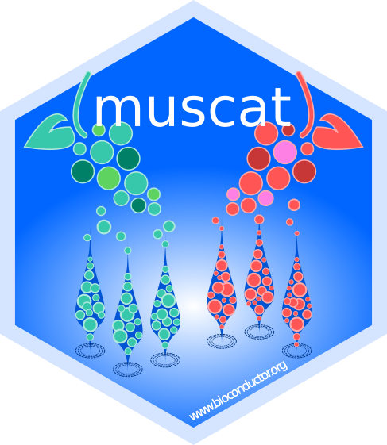

# `muscat`  

`muscat` (**Mu**lti-sample **mu**lti-group **sc**RNA-seq **a**nalysis **t**ools )  
provides various methods for *Differential State* (DS) analyses in  
multi-sample, multi-group, multi-(cell-)subpopulation scRNA-seq data,  
as elaborated in our preprint:

> Crowell HL, Soneson C\*, Germain P-L\*,  
Calini D, Collin L, Raposo C, Malhotra D & Robinson MD:  
On the discovery of population-specific state transitions from  
multi-sample multi-condition single-cell RNA sequencing data.  
*bioRxiv* **713412** (July, 2019). doi: [10.1101/713412](https://doi.org/10.1101/713412)

*These authors contributed equally.

***

Let `sce` be a `r BiocStyle::Biocpkg("SingleCellExperiment")` object with cell metadata (`colData`) columns

1. `"sample_id"` specifying unique sample identifiers (e.g., PeterPan1, Nautilus7, ...)
2. `"group_id"` specifying each sample's experimental condition (e.g., reference/stimulated, healthy/diseased, ...)
3. `"cluster_id"` specifying subpopulation (cluster) assignments (e.g., B cells, dendritic cells, ...)

Aggregation-based methods come down to the following simple commands: 

```{r}
# compute pseudobulks (sum of counts)
pb <- aggregateData(sce, 
    assay = "counts", fun = "sum",
    by = c("cluster_id", "sample_id"))
    
# run pseudobulk (aggregation-based) DS analysis
ds_pb <- pbDS(pb, method = "edgeR")
```

Mixed models can be run directly on cell-level measurements, e.g.:

```{r}
ds_mm <- mmDS(sce, method = "dream")
```

For details, see the package vignette.