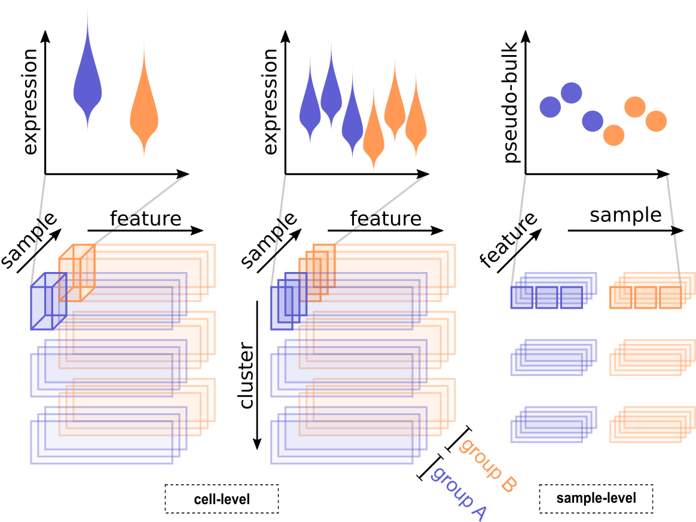

<style type="text/css">
.smaller {
  font-size: 10px
}
</style>

```{r echo = FALSE, warning = FALSE, message = FALSE}
knitr::opts_chunk$set(autodep = TRUE, cache = TRUE)
```

```{r load-libs, warning = FALSE, message = FALSE}
library(ComplexHeatmap)
library(cowplot)
library(dplyr)
library(ggplot2)
library(muscat)
library(purrr)
```

# Introduction

## What is DS analysis?

A fundamental task in the analysis of single-cell RNA-sequencing (scRNA-seq) data is the identification of systematic transcriptional changes[@Stegle2015]. Such analyses are a critical step in the understanding of molecular responses, and have applications in development, in perturbation studies or in disease.  
Most of the current scRNA-seq differential expression (DE) analysis methods are designed to test one set of cells against another (or more generally, multiple sets together), and can be used to compare cell clusters (e.g., for identifying marker genes) or across conditions (cells from one condition versus another) [@Soneson2018]. In such statistical models, the cells are the experimental units and thus represent the population that inferences will extrapolate to.

Using established terminology, we refer to cell *identity* as the combination of cell *type*, a stable molecular signature, and cell *state*, a transient snapshot of a cell's molecular events [@Wagner2016; @Trapnell2015]. This classification is inherently arbitrary, but still provides a basis for biological interpretation and a framework for discovering interesting expression patterns from scRNA-seq datasets. For example, T cells could be defined as a single (albeit diverse) cell type or could be divided into discrete subtypes, if relevant information to categorize each cell at this level were available. In either case, the framework presented here would be able to focus on the cell type of interest and look for changes (in expression) across samples.  
Given the emergence of multi-sample multi-group scRNA-seq datasets, the goal becomes making sample-level inferences (i.e., experimental units are samples). Thus, differential state (DS) analysis is defined as following a given cell type across a set of samples (e.g., individuals) and experimental conditions (e.g., treatments), in order to identify cell-type-specific responses, i.e., changes in cell state. DS analysis: i) should be able to detect diluted changes that only affect a single cell type, a subset of cell types or even a subset of a single subpopulation; and, ii) is intended to be orthogonal to clustering or cell type assignment. 

## Starting point

The starting point for a DS analysis is a (sparse) matrix of gene expression, either as counts or some kind of normalized data, where rows = genes and columns = cells. Each cell additionally has a cluster (subpopulation) label as well as a sample label; metadata should accompany the list of samples, such that they can be organized into comparable groups with sample-level replicates (e.g., via a design matrix). 

The approach presented here is modular and thus subpopulation labels could originate from an earlier step in the analysis, such as clustering [@Duo2018; @Freytag2018], perhaps after integration  [@Butler2018; @Stuart2019] or after labeling of clusters [@Diaz-Mejia2019] or after cell-level type assignment [@Zhang2019].

# Getting started

## Data description

For this vignette, we will use a `r Biocpkg("SingleCellExperiment")` (SCE) containing 10x droplet-based scRNA-seq PBCM data from 8 Lupus patients obtained befor and after 6h-treatment with IFN-$\beta$ (@Kang2018-demuxlet). The complete raw data, as well as gene and cell metadata is available through the NCBI GEO, accession number [GSE96583](https://www.ncbi.nlm.nih.gov/geo/query/acc.cgi?acc=GSE96583). 

## Loading the data

The @Kang2018-demuxlet dataset has been made available through Biocondcutor's `ExperimentHub` and can be loaded into R as follows: We first initialize a Hub instance to search for and load available data with the `ExperimentHub` function, and store the complete list of records in the variable `eh`. Using `query`, we then retrieve any records that match our keyword(s) of interest, as well as their corresponding accession ID (EH1234).

```{r eh, cache = TRUE, message = FALSE}
library(ExperimentHub)
eh <- ExperimentHub()
query(eh, "Kang")
```

Finally, we load the data of interest into R via `[[` and the corresponding accession ID. The dataset contains >35,000 genes and ~29,000 cells:

```{r load-data, message = FALSE}
(sce <- eh[["EH2259"]])
```

## Preprocessing

The `r Biocpkg("scater")` package [@McCarthy2017-scater] provides a variey of tools for preprocessing and quality control of single-cell transcriptomic data. For completeness, we will apply some minimal filtering steps to

- remove undetected genes
- remove cells with very few or many detected genes
- remove very lowly expressed genes
- compute normalized expression values for visualization

For more thorough preprocessing, we refer to the [Quality control with *scater*](https://bioconductor.org/packages/release/bioc/vignettes/scater/inst/doc/vignette-qc.html) vignette.

```{r fil}
# remove undetected genes
sce <- sce[rowSums(counts(sce) > 0) > 0, ]
dim(sce)
```

We use `calculateQCMetrics` to compute various quality control metrics for each cell and gene, stored in the `colData` and `rowData`, respectively, and proceed with filtering cells and genes as noted above:

```{r qc, message = FALSE}
# calculate quality control (QC) metrics
library(scater)
sce <- calculateQCMetrics(sce)

# get cells w/ few/many detected genes
sce$is_outlier <- isOutlier(
    metric = sce$total_features_by_counts,
    nmads = 2, type = "both", log = TRUE)

# remove outlier cells
sce <- sce[, !sce$is_outlier]
dim(sce)

# remove lowly expressed genes
sce <- sce[rowSums(counts(sce) > 1) >= 10, ]
dim(sce)
```

Finally, we use `normalize` to calculate log$_2$-transformed normalized expression values by dividing each count by its size factor, adding a pseudo-count of 1, and log-transforming[^1].  

[^1]: Note that, in this workflow, expression values are used for visualization only, and that differential analysis is performed on cluster-sample aggregates; see section \@ref(sec-agg).

```{r norm}
# compute sum-factors & normalize
sizeFactors(sce) <- librarySizeFactors(sce)
sce <- normalize(sce)
```

Alternatively, expression values could be obtained via `vst` (variance stabilizing transformation) from the `r CRANpkg("sctransfrom")` package [@Hafemeister2019-sctransform], which returns Pearson residuals from a regularized negative binomial regression model that can be interpreted as normalized expression values:

```{r vst, eval = FALSE}
library(sctransform)
assays(sce)$vstresiduals <- vst(counts(sce), show_progress = FALSE)$y
```

## Data preparation

`muscat` expects a certain format of the input SCE. Specifically, the following cell metadata (`colData`) columns have to be provided: 

- `"sample_id"`: unique sample identifiers (e.g., PeterPan_ref1, Nautilus_trt3, ...)
- `"cluster_id"`: subpopulation (cluster) assignments (e.g., T cells, monocytes, ...)
- `"group_id"`: experimental group/condition (e.g., control/treatment, healthy/diseased, ...)

```{r prep-sce} 
sce$id <- paste0(sce$stim, sce$ind)
(sce <- prepSCE(sce, 
    cluster_id = "cell", # subpopulation assignments
    group_id = "stim",   # group IDs (ctrl/stim)
    sample_id = "id",    # sample IDs (ctrl/stim.1234)
    drop = TRUE))        # drop all other colData columns
```

For consistency and easy accession throughout this vignette, we will store cluster and sample IDs, as well as the number of clusters and samples into the following *simple* variables:

```{r ids}
nk <- length(kids <- levels(sce$cluster_id))
ns <- length(sids <- levels(sce$sample_id))
names(kids) <- kids; names(sids) <- sids
```

## Data overview

### Cluster-sample sizes

As we will be aggregating measurements at the cluster-sample level, it is of particular importance to check the number of cells captured for each such instance. While `aggregateData` (see Section \@ref(sec-agg)) allows excluding cluster-sample combinations with less than a threshold number of cells, clusters or samples with overall very low cell-counts may be excluded from further analysis at this point already.

For the Kang dataset, for example, we might consider removing the *Dendritic cells* and *Megakaryocytes* clusters, as these containg less than 50 cells across all samples.

```{r ncells, size = "tiny"}
# nb. of cells per cluster-sample
options(width = 100)
table(sce$cluster_id, sce$sample_id)
```

### Dimension reduction {.tabset}

The dimension reductions (DR) available within the SCE can be accessed via `reducedDims` from the `r Biocpkg("scater")` package. The data provided by Kang et al. already contains t-SNE coordinates; however, we can of course compute additional dimension reductions using one of `r Biocpkg("scater")`'s `runX` functions:

```{r umap}
# compute UMAP using 1st 20 PCs
sce <- runUMAP(sce, pca = 20)
```

Using `r Biocpkg("scater")`'s `plotReducedDim` function, we can plot both t-SNE and UMAP representations colored by cluster and group IDs, respectively:

```{r dr-ids, results = "asis", fig.height = 6, fig.width = 14, fig.cap = "Dimension reduction plots. Cells are colored by cluster ID (A) and group ID (B), respectively."}
# wrapper to prettify DR plots
.plot_dr <- function(sce, dr, col) {
  plotReducedDim(sce, use_dimred = dr, colour_by = col) +
    guides(fill = guide_legend(override.aes = list(alpha = 1, size = 3))) +
    theme_minimal() + theme(aspect.ratio = 1)
}

for (dr in c("TSNE", "UMAP")) {
  cat("#### ", dr, "{-}\n")
  # plot DR colored by cluster & group ID
  ps <- lapply(c("cluster_id", "group_id"), 
    function(col) .plot_dr(sce, dr, col = col))
  # store for later
  assign(paste0("ps_", tolower(dr)), ps)
  # arrange plots side-by-side
  print(plot_grid(plotlist = ps, align = "vh", labels = c("A", "B")))
  cat("\n\n")
}
```

For our dataset, the t-SNE and UMAP colored by `cluster_id`s (Figures \@ref(fig:tsne)&\@ref(fig:umap)A) show that cell-populations are well-separated from one another. INF-beta stimulation manifests as a severe shift in the low-dimensional projection of cells when coloring by `group_id`s (Figures \@ref(fig:tsne)&\@ref(fig:umap)B), indicating widespread, genome-scale transcriptiontal changes. 

# Differential State (DS) analysis

## Aggregation of single-cell to pseudobulk data {#sec-agg}

In order to leverage existing robust bulk RNA-seq DE frameworks, such as `r Biocpkg("edgeR")` [@Robinson2010-edgeR], `r Biocpkg("DESeq2")` [@Love2014-DESeq2], and `r Biocpkg("limma")` [@Ritchie2015-limma], we first aggregate measurements for each sample (in each cluster) to obtain pseudobulk data.

```{r echo = FALSE, out.height = 5, fig.cap = "Schematic overview of cell- and sample-level approaches for DS analysis. Top panels show a schematic of the data distributions or aggregates across samples (each violin is a group or sample; each dot is a sample) and conditions (blue or orange). The bottom panels highlight the data organization in sub-matrix slices of the original count table."}
#knitr::include_graphics(file.path(system.file("extdata", package = "muscat"), "ds_approaches.png"))

```

In general, `aggregateData()` will aggregate the data by the `colData` variables specified with argument `by`, and return a `SingleCellExperiment` containing pseudobulk data.  
For DS analysis, measurements must be aggregated at the cluster-sample level (default `by = c("cluster_id", "sample_id"`). In this case, the returned `SingleCellExperiment` will contain one assay per cluster, where rows = genes and columns = samples. Argument `assay` and `fun` specify the input data and summary statistic, respectively, to use for aggregation.  
While, in principle, various combinations of input data (raw/(log-)normalized counts, CPM ect.) and summary statistics (sum, mean, median) could be applied, we here default to the sum of raw counts:

```{r agg}
pb <- aggregateData(
    x = sce, assay = "counts", fun = "sum",
    by = c("cluster_id", "sample_id"))
# one sheet per subpopulation
assayNames(pb)
# pseudobulks for 1st subpopulation
options(width = 100)
head(assay(pb))
```

## Pseudobulk-level MDS plot

Prior to conducting any formal testing, we can compute a multi-dimensional scaling (MDS) plot of aggregated signal to explore overall sample similarities. 

`pbMDS` takes as input any SCE containg PB data as returned by `aggregateData`, and computes MDS dimensions using `r Biocpkg("edgeR")`. Ideally, such a represenation of the data should separate both clusters and groups from one another. Vice versa, samples from the same cluster or group should cluster together.

In our MDS plot on pseudo-bulk counts (Fig. \@ref(fig:pb-mds)), we can observe that the first dimension (MDS1) clearly separates cell-populations (clusters), while the second (MDS2) separates control and stimulated samples (groups). Furthermore, the two T-cell clusters fall close to each other. 

```{r pb-mds, fig.height = 5, fig.cap = "Pseudobulk-level multidimensional scaling (MDS) plot. Each point represents a cluster-sample instance; points are colored by cluster ID and shaped by group ID."}
pbMDS(pb)
```

## Sample-level analysis: Pseudobulk methods {.smaller}

Once we have assembled the pseudo-bulk data, we can test for cluster-level DE using `runDS`. We specify a design matrix capturing the experimental design using `model.matrix` (package `r Rpackage("stats")`), and a contrast matrrix that specifies our comparison of interesting using `makeContrasts` from the `r Biocpkg("limma")` package. Alternatively, the comparison of interest (or a list thereof) can be specified with via `coefs` (see `?glmQLFTest` for details).

For the Kang dataset, we want to carry out a single comparison of stimulated against control samples, thus placing `"ctrl"` on the right-hand side as the reference condition. 

```{r}
# construct design & contrast matrix
# ei <- metadata(sce)$experiment_info
# design <- model.matrix(~ 0 + ei$group_id)
# dimnames(design) <- list(ei$sample_id, levels(ei$group_id))
# contrast <- makeContrasts("stim-ctrl", levels = design)

# run DE analysis
res <- pbDS(pb, verbose = FALSE)
# access results
tbl <- res$table[[1]]
# one data.frame per cluster
names(tbl)
# view results for 1st cluster
head(tbl[[1]])
```

## Cell-levels analysis: Mixed models

Alternative to the above sample-level approach, we fit (for each gene) a mixed model (MM) to the cell-level measurement data. `muscat` provides implementations of MM that use 3 main approaches:

1. fitting linear mixed models (LMMs) on log-normalized data with observational weights, 
2. fitting LMMs on variance-stabilized data; and,
3. fitting generalized linear mixed models (GLMMs) directly on counts

In each case, a $\sim 1 + \text{group_id} + (1|\text{sample_id})$ model is fit for each gene, optimizing the log-likelihood (i.e. `REML = FALSE`). P-values are calculated using the estimates of degrees of freedom specifying by argument `df` (default `"Satterthwaite"`). Fitting, testing and moderation are applied subpopulation-wise. For differential testing, `mmDS` will only consider:

- subpopulations with at least `n_cells` cells (default 10) in at least `n_samples` samples (default 2)
- genes with a count >= `min_count` (default 1) in at least `min_cells` (default 20)

Mixed model based approaches can be run directly on cell-level measurements, and do not require prior aggregation:

```{r mm, eval = FALSE}
# 1st approach
mm <- mmDS(sce, method = "dream",
  n_cells = 10, n_samples = 2,
  min_counts = 1, min_cells = 20)

# 2nd & 3rd approach
mm <- mmDS(sce, method = "vst", vst = "sctransform", ...)
mm <- mmDS(sce, method = "nbinom", ...)
```

# Handling results

## Results filtering & overview {.smaller}

To get a general overview of the differential testing results, we first filter them to retain hits FDR < 5\% and abs(logFC) > 1, and count the number and frequency of differential findings by cluster. Finally, we can view the top hits (lowest adj. p-value) in each cluster.

```{r}
# filter FDR < 5%, abs(logFC) > 1 & sort by adj. p-value
tbl_fil <- lapply(tbl, function(u) {
  u <- dplyr::filter(u, p_adj.loc < 0.05, abs(logFC) > 1)
  dplyr::arrange(u, p_adj.loc)
})

# nb. of DS genes & % of total by cluster
n_de <- vapply(tbl_fil, nrow, numeric(1))
p_de <- format(n_de / nrow(sce) * 100, digits = 3)
data.frame("#DS" = n_de, "%DS" = p_de, check.names = FALSE)

# view top 2 hits in each cluster
bind_rows(lapply(tbl_fil, top_n, 2, p_adj.loc))
```

## Calculating expression frequencies {.smaller}

Besides filter DS results based on magnitude (logFCs) and significance (FDR), it is often worthwhile to also consider the expression frequencies of each gene, i.e., the fraction of cells that express a given gene in each sample and/or group.  
`muscat` provides wrapper, `calcExprFreqs` to compute cluster-sample/-group wise expression frequencies. Here, a gene is considered to be expressed when the specified measurement value (argument `assay`) falls above a certain threshold (argument `th`). Note that, `assay = "counts"` and `th = 0` (default) amounts to the fraction of cells for which a respective gene has been detected.  
`calcExprFreqs` will return a `r Biocpkg("SingleCellExperiment")` object, where sheets (assays) = clusters, rows = genes, and columns = samples (and groups, if `group_id`s are present in the `colData` of the input SCE). 

```{r frq}
frq <- calcExprFreqs(sce, assay = "counts", th = 0)
# one sheet per cluster
assayNames(frq)
# expression frequencies in each
# sample & group; 1st cluster
options(width = 100)
head(assay(frq))
```

We can use the obtained frequencies to, for instance, only retain genes that are expressed in an average of 10\% of cells across all sample:

```{r}
(avg_frq10 <- vapply(as.list(assays(frq)), 
  function(u) rowMeans(u[, sids]) > 0.1, 
  logical(nrow(sce)))) %>% head

tbl_fil2 <- lapply(kids, function(k)
  dplyr::filter(tbl_fil[[k]], 
    gene %in% names(which(avg_frq10[, k]))))

# nb. of DS genes & % of total by cluster
n_de <- vapply(tbl_fil2, nrow, numeric(1))
p_de <- format(n_de / nrow(sce) * 100, digits = 3)
data.frame("#DS" = n_de, "%DS" = p_de, check.names = FALSE)
```

## Formatting results

Especially when testing multiple contrasts or coefficients, the results returned by `runDS` may become very complex and unhandy for exploration or exporting. Results can be formatted using `resDS`, which provides two alternative modes for formatting: `bind = "row"/"col"`.

When `bind = "row"`, results from all comparisons will be merged vertically (analogouse to `do.call("rbind", ...)`) into a tidy format table, with column `contrast/coef` specifying the comparison.

Otherwise, `bind = "col"`, results will be merge horizontally into a single wide table where all results for a given gene and cluster are kept in one row. An identifier of the respective contrast of coefficient is then appended to the column names. This format is useful when wanting to view a specific gene's behavior across, for example, multiple treatments, but will become *messy* when many comparisons are included. 

Expression frequencies computed with `calcExprFreqs`, as well as cluster-sample level avg. CPM, can be included in the results by setting `frq/cpm = TRUE`. Alternatively, if the former have been pre-computed, they can be supplied directly as an input to `resDS` (see example below).

```{r eval = FALSE}
tbl_big <- resDS(sce, res, bind = "row", frq = frq, cpm = FALSE)
tbl_tdy <- resDS(sce, res, bind = "col", frq = frq, cpm = FALSE)
```

# Visualizing results

## Between-cluster concordance

DS analysis aims at identifying population-specific changes in state (or expression) across conditions. In this setting, key questions of interest arise, e.g., which genes are DE in only a single (or very few) clusters? How many DE genes are shared between clusters? In summary, what is the general concordance in differential findings between clusters?

To gain an impression of the between-cluster (dis-)agreement on DE genes, we generate an upset-plot that visualizas the number of DE genes that are shared across or unique to certain clusters:

```{r upset, fig.width = 10, fig.cap = "Upset plot. Included are DS findings (FDR < 0.05, |logFC| > 1) across all clusters; shown are the 80 most frequent interactions."}
library(UpSetR)
de_gs_by_k <- map(tbl_fil, "gene")
upset(fromList(de_gs_by_k), sets = kids, 
  nintersects = 80, mb.ratio = c(0.4, 0.6))
```

An upset plot as the one above tells us, for instance, that 185 genes are differential for all subpopulations; 387 across both *Monocytes* clusters; and 169 only in the *B cells* cluster.

## Dim. reduction colored by expression

The code chunk generates a set of t-SNEs colored by gene expression for the top DS gene in each subpopulation. To facilitate matching the affected cells to their cluster and experimental group, we also add the t-SNEs colored by subpopulation and group ID, respectively, that are plotted above (Fig. \@ref(fig:t-sne)).  

```{r fig.height = 12, fig.width = 16, fig.cap = "t-SNE colored by gene expression. Show are t-SNE projections with cells colored by cluster and group ID (top row), and by the expression of the top DE gene for each cluster (bottom row)."}
ps_expr <- lapply(kids, function(k) {
  g <- tbl_fil[[k]]$gene[1]
  .plot_dr(sce, "TSNE", g) + 
    ggtitle(sprintf("%s(%s)", g, k)) +
    theme(legend.position = "none")
})
row1 <- plot_grid(plotlist = ps_tsne, ncol = 2, align = "vh")
row2 <- plot_grid(plotlist = ps_expr, ncol = 4, align = "vh")
plot_grid(row1, row2, ncol = 1, rel_heights = c(2, 3))
```

## Cell-level expression profiles by cluster-sample {.tabset}

For changes of high interest, we can view the cell-level expression profiles of a specific gene across samples or groups using `plotExpression` (`r Biocpkg("scater")` package). 

Here, we generate violins plot for the top DE genes (lowest adj. p-value) in the first three clusters (Fig. \@ref(fig:violins)). Note that, as we are testing for DE on the cluster-level, we need to subset the cells that have been assigned to a given cluster for plotting. 

```{r eval = FALSE}
# generate violins for top hits by cluster
lapply(kids, function(k) {
  u <- sce[, sce$cluster_id == k]     # subset this cluster
  gs <- tbl_fil[[k]]$gene[seq_len(12)] # get top hits
  
  plotExpression(u, features = gs, x = "sample_id", 
    point_size = 0.4, colour_by = "group_id", ncol = 4) +
    ggtitle(k) + theme(legend.position = "none",
      axis.text.x = element_text(angle = 45, hjust = 1))
})
```

```{r violins, results = "asis", echo = FALSE, fig.height = 8, fig.width = 12, fig.cap = "Violin plots. Show are the top 12 hits (lowest adj. p-value) for a given cluster. Each violin is a sample; coloring corresponds to experimental groups (blue = control, orange = stimulated)."}
for (k in kids) {
  cat("### ", k, "{-}\n")
  print(plotExpression(sce[, sce$cluster_id == k], 
    features = tbl_fil[[k]]$gene[seq_len(12)], x = "sample_id", 
    colour_by = "group_id", point_size = 0.4, ncol = 4) +
    theme_classic() + theme(legend.position = "none", 
      axis.text.x = element_text(angle = 45, hjust = 1)))
  cat("\n\n")
}
```

## Heatmap of cluster-sample expression means

Especially when wanting to gain an overview of numerous DE testing results for many clusters, bothm dimension reduction and cell-level visualisations require a lot of space can become cumbersome to interpret. In this setting, it is thus recommendable to visualise aggregated measures, e.g., mean expressions by cluster sample. We can use `aggregateData` to assemble cluster-sample level mean expression values for all genes, and visualize any hits of interest.

```{r}
# compute cluster-sample expression means
ms <- aggregateData(sce, assay = "logcounts", fun = "mean")
ms <- data.frame(
    row.names = NULL, gene = rownames(ms),
    cluster_id = rep(assayNames(ms), each = nrow(sce)),
    do.call("rbind", as.list(assays(ms))))

n <- 3 # nb. of genes to plot per cluster
top <- lapply(kids, function(k) {
    u <- dplyr::arrange(tbl[[k]], p_adj.loc)
    u <- u[seq_len(n), ]
    ms %>% dplyr::filter(gene %in% u$gene & cluster_id %in% u$cluster_id)
})
# assemble means from all clusters
top <- do.call("rbind", top)
# set rownames & remove un-needed columns
rownames(top) <- with(top, sprintf("%s(%s)", gene, cluster_id))
top <- select(top, -c("gene", "cluster_id"))
mat <- as.matrix(top)
mat <- muscat:::.scale(mat)
# plot heatmap of cluster-sample expression means
Heatmap(mat,
    name = "mean\nexpression",
    cluster_rows = FALSE,
    cluster_columns = FALSE,
    row_names_gp = gpar(fontsize = 8))
```

Alternatively, `plotDiffHeatmap` provides a set of options regarding which genes, cluster, and comparisons to include (arguments `k`, `g` and `c`, respectively).

For example, the following options render a heatmap visualizing the top 20 DS genes for the B cells cluster:

```{r eval = FALSE}
# plot top results for a single cluster
plotDiffHeatmap(sce, res, k = "B cells", sort_by = "p_adj.loc", top_n = 20)
```

Similarly, we can visualize the cluster-sample means of a single gene of interest across all clusters in order to identify cell-types that are affected similarly by different experimental conditions:

```{r eval = FALSE}
# plot single gene across all clusters
plotDiffHeatmap(sce, res, g = rownames(sce)[1])
```

# Session info {.smaller}

```{r}
sessionInfo()
```

# References